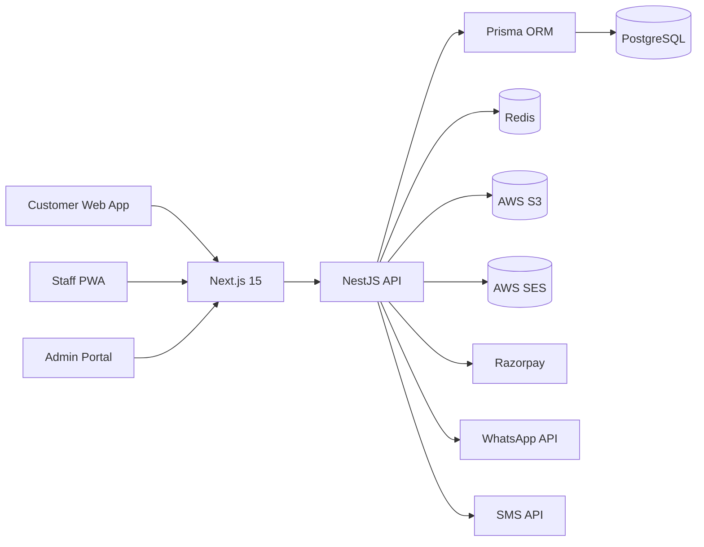

# Architecture

## Notes

- Web and staff/admin experiences share the same design system and components.
- The API is organized by domain modules.
- Prisma is the system of record for bookings, tables, slots, check-ins, payments, notifications, and audit logs.
